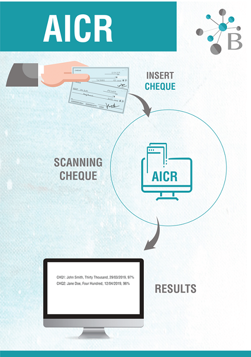
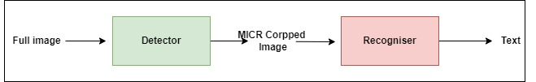
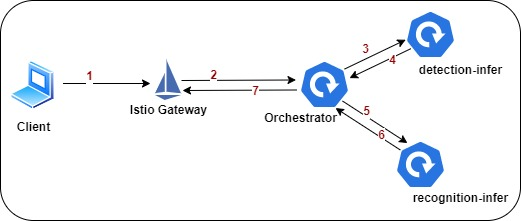

An easy and fast way to serve machine learning inference graphs at scale on Kubernetes.

Moving machine learning models from lab to production is not an easy task. In fact, in many ML projects, it is as challenging as solving the actual data modelling problem or even harder. According to [Algorithmia 2021 survey](https://info.algorithmia.com/tt-state-of-ml-2021), 64% of organisations take them a month or longer to deploy a trained model to production. The report also states that 38% of organisations spend more than 50% of their data scientists’ time on deployment. In this article, we will see how deploying machine learning can be easier and quicker with Seldon. As a walk-through example, we will be using Seldon to build the inference graph of an AI OCR that reads Checks. The focus is on Model-as-Service deployment type.

This article is organised as follow:
  1. [A brief introduction about the AI Checks Reader project.](#ai-ocr-intro)
  2. [`seldon-core-microservice` to convert model & code into fully-fledged microservice](#seldon-core-microservice).
  3. [`Seldon Deployment CRD` to deploy inference graph on Kubernetes.](#deployment)
  4. [Testing Seldon Deployment](#testing).
  5. [Seldon Limitations](#limitations).
  6. [Conclusion](#conclusion)


>**NOTE**
> The prerequisites to this article:
> - Basic knowledge of Docker.
> - Basic knowledge of Kubernetes.
> - A created Kubernetes cluster with Istio ingress.
> - Installing [Seldon operator](https://docs.seldon.io/projects/seldon-core/en/latest/examples/seldon_core_setup.html) on Kubernetes.
> - The code is on https://github.com/BoundlessView/seldon-deployment-ai-ocr

_*Disclaimer: We have no affiliation with or interest vested in Seldon.io. The aim of the article is purely to share our experience at [BoundlessView](http://boundlessview.com) on how we used Seldon.*_

## 1. A brief introduction about the AI Checks Reader project <a name="ai-ocr-intro"></a>

The business motivation is that banks want to reduce manual data entry to shorten the check processing life cycle.

**The main functional requirement:** is to extract all textual information from check images. For simplicity, in this writing, the task is limited to extracting only the MICR text from check images.

<p align="center">
  
</p>

**The non-functional requirement:** OCR functionality has to be deployed at scale and exposed as an API.

**Project main challenges:** the images arrive in several layouts or templates, and many of them contain a mixed text of handwritten and printed or written in two languages; English and Arabic. 

**The solution:** tackled the two vision problems as follow:
 - [Faster R-CNN](https://arxiv.org/abs/1506.01497) is used to detect and locate the fields of interest and identify the text language on check images. 
 - Custom implementation of a sequence neural network is used to recognise the text. In a separate story, we will share how our proprietary network achieved 5-7x inferencing speed compared to LSTM.

**The deployment challenge:**
Once the required accuracy was attained at the lab, we thought the mission was accomplished. However, as soon as we started production planning, we realised several challenges. We came up with these thoughts and requirements:

- Putting all the models in a monolith service is not a good idea because each model has different hardware requirements.
- The research and development are in progress to enhance the accuracy and speed, so the models will be updated frequently and at a different rate. This is another reason support decoupling the system into microservices.
- We need an orchestrator to control data flow between the microservices.
- The caveat for the latter is that we don’t want to implement the orchestrator ourselves.
- The final product will consist of 5 microservices. We need to run them on Kubernetes, but we want to avoid the overhead of creating and managing Kubernetes resources, including deployment, services, virtual services,...etc


The rest of the article illustrates how these requirements are accomplished by [Seldon Core](https://docs.seldon.io/projects/seldon-core/en/latest/index.html). Seldon Core is an open-source framework that makes it easier and faster to deploy machine learning models at scale on Kubernetes.

## 2. `seldon-core-microservice` to convert model & code into fully-fledged microservice <a name="seldon-core-microservice"></a>

#### Serving models:
The idea of serving is to convert the model weights file into something that can respond to requests. Seldon provides solutions to so many cases in MLOps space. The easiest and fastest one is [Prepackaged Model Servers](https://docs.seldon.io/projects/seldon-core/en/latest/servers/overview.html?highlight=%20Prepackaged%20Model%20Servers). You only need to provide the model's file location to get it turned into a service and deployed straightway on Kubernetes. In our case, this option is not appropriate. In both ML tasks, the final inference output results from preprocessing the input data and evaluating it on a deep learning model. What solves our problem is Seldon Core [Python Language Wrapper `seldon-core-microservice`](https://docs.seldon.io/projects/seldon-core/en/latest/nav/config/wrappers.html) that containerises machine learning models and code and produces docker images that are ready to run and serve requests through either REST or gRPC interfaces.

Before we dive into how the code and model are converted into a microservice, we need to clarify a few concepts:

- `seldon-core-microservice` wrapper expects us to create a Python class, as an entrypoint, that implements one of the abstract methods that the wrapper recognises.
- To decide which method to include in the class, we have first to identify the service or the [component type](https://docs.seldon.io/projects/seldon-core/en/latest/python/python_component.html) of the microservice. 
- Seldon core offers four components; Model, Combiners, Routers and Transformers. The decision on which type to select depends on what the microservice is doing and its location in the runtime inference graph. For example; 
    1. If the service receives an observation and makes a prediction, then the component or service type is MODEL, and the class has to implement the `predict()` method.  
    2. If the service is needed to combine outputs from another two MODEL services, then the component type is COMBINER, and the class has to implement `aggregate()` method.
    3. For further details, [Python Components](https://docs.seldon.io/projects/seldon-core/en/latest/python/python_component.html) and [Graphs](https://docs.seldon.io/projects/seldon-core/en/latest/examples/graph-metadata.html?)

- The data flow of our two MODEL services inference graph:
 <a name="inference-graph"></a>

**Detector**: is the text detector and localiser. Its `predict()` method receives the check image, predicts the check's bounding box, and returns the cropped MICR area.

**Recogniser**: is the text recogniser. Its `predict()` method receives the cropped image and predicts the text.

#### Building docker images: 

For the detection task: 
- Python class `src\inference\detection\Serving.py` implments `predict()` method which preprocess the input data and run model's evaluation function. The model is loaded in the initilization method.
 
- In the Docker file, we have to use one of Seldon's docker base images. 
```dockerfile
# syntax=docker/dockerfile:1.2
FROM seldonio/seldon-core-s2i-python36:1.1.0
ARG EXPERIMENT_NAME
WORKDIR /app
#install dependencies
RUN python3.6 -m pip install pip==19
RUN pip install opencv-python-headless==4.2.0.34 \
                intel_tensorflow==1.14.0 \                
                gast==0.2.2 \                
                pyyaml \                
                git+https://github.com/tensorpack/tensorpack.git@v0.9.8
#copy Python class and model.
COPY models/$EXPERIMENT_NAME/compact.pb /app/compact.pb
COPY models/$EXPERIMENT_NAME/config.yaml /app/config.yaml
COPY src/inference/$EXPERIMENT_NAME/* /app/
CMD seldon-core-microservice $MODEL_NAME $API_TYPE --service-type $SERVICE_TYPE --persistence $PERSISTENCE
```
At the run time, `seldon-core-microservice` Python wrapper turns Serving.py into a fully operational microservice that receives requests on REST/gRPC interfaces.

```bash
docker build --build-arg EXPERIMENT_NAME='detection' -t boundlessview/detection-infer:v1.0.0 -f docker/detection/inference.dockerfile ./
docker push  boundlessview/detection-infer:v1.0.0
```
For the recognition task, the same structure is followed as for the detection.
```bash
docker build --build-arg EXPERIMENT_NAME='recognition' -t boundlessview/recognition-infer:v1.0.0 -f docker/recognition/inference.dockerfile ./
docker push boundlessview/recognition-infer:v1.0.0
```


## 3. `Seldon Deployment CRD` to deploy inference graph on Kubernetes <a name="deployment"></a>


**How are we going to run those microservices on Kubernetes?** A possible answer is creating a typical [Kubernetes Deployment](https://kubernetes.io/docs/concepts/workloads/controllers/deployment/) for each docker image. This is fine, but how the detector service is going to connect to the recogniser? Each microservice is prepared to evaluate the input data on the loaded ML model and return a result, while in our [inference graph](#inference-graph), the output of the detector needs to be forwarded to the recogniser. So, an Orchestration is required here to facilitate this communication. Seldon Core provides this out of the box through [Seldon Deployment CRD](https://docs.seldon.io/projects/seldon-core/en/latest/workflow/overview.html#seldondeployment-crd) (Custom Resource Definition).

As described in the original [documentation](https://docs.seldon.io/projects/seldon-core/en/latest/graph/inference-graph.html), the key components of Seldon Deployment CRD:

- A list of `Predictors`, each with a specification for the number of replicas.

- Each defines a graph and its set of deployments. Multiple predictors is useful when we want to split traffic between a main graph and a canary or for other production rollout scenarios.

- For each predictor a list of `componentSpecs`. Each `componentSpec` is a Kubernetes `PodTemplateSpec` which Seldon will build into a Kubernetes Deployment. Place here the images from your graph and their requirements, e.g. `Volumes`, `ImagePullSecrets`, `Resources Requests` etc.

- A graph specification that describes how our components are joined together. 

```yaml
apiVersion: machinelearning.seldon.io/v1alpha2
kind: SeldonDeployment
metadata:
  name: checks-reader
  namespace: default
  labels:
    app: seldon
spec:
  annotations:
    deployment_version: v1
  name: checks-reader
  predictors:
  - componentSpecs:
    - spec:
        containers:
        - image: boundlessview/detection-infer:latest
          name: detection-infer
          env:
          - name: API_TYPE
            value: "REST"
          - name: MODEL_NAME
            value: "Serving"
          - name: SERVICE_TYPE
            value: "MODEL"
    - spec:
        containers:
        - image: boundlessview/recognition-infer:latest
          name: recognition-infer
          env:
          - name: API_TYPE
            value: "REST"
          - name: MODEL_NAME
            value: "Serving"
          - name: SERVICE_TYPE
            value: "MODEL"
    graph:
      name: detection-infer
      endpoint:
        type: REST
      type: MODEL
      parameters:
      - name: input_tensor_names
        value: "image"
        type: STRING
      - name: output_tensor_names
        value: "output/boxes"
        type: STRING
      - name: prefix_name
        value: "TDServing"
        type: STRING
      children:
        - name: recognition-infer
          endpoint:
            type: REST
          type: MODEL
          parameters:
          - name: input_tensor_names
            value: "image,input_length"
            type: STRING
          - name: output_tensor_names
            value: "ema/output/labels,ema/output/probs"
            type: STRING
          - name: prefix_name
            value: "TRServing"
            type: STRING
          children: []
    name: main
    replicas: 1
```
> The variables in the `parameters` list are arguments passed to the initialization method of `Serving.py` class. 

A prerequisite to applying this Seldon deployment on Kubernetes is installing [Seldon operator](https://docs.seldon.io/projects/seldon-core/en/latest/examples/seldon_core_setup.html). The operatror reads the CRD definition of Seldon Deployment resources applied to the cluster and ensures that all required components like pods, services, virtual services are created. It also creates `Orchestrator` for this deployment, responsible for managing the intra-graph traffic. 


<p align="center">
  
</p>

**The data flows as follow:**

1- Istio Gateway receives the client's request.
2- It forwards the request to Orchestrator.
3- The Orchestrator manages the traffic according to how the components are structured in the `graph` element in Seldon Deployment. So for our case, it sends the request to `detection-infer`.
4-5 The Orchestrator routes the output of  `detection-infer` to `recognition-infer`.
6-7 The Orchestrator sends the output of `recognition-infer` to the client.


**Apply Seldon deployment**
```sh
kubectl apply -f kube\seldon-deployment.yml
#show the pods
```
The deployemnt can be scaled


##  4. Testing Seldon Deployment  <a name="testing"></a>
Client testing scripts are available in this notebook `notebook\client-test.ipynb`. There is one to send http request and the other grpc. 


## 5. Seldon Limitations <a name="limitations"></a>

Data flows in the inference graph from one component to another in one direction. The component's output can't be forked between or branched into multiple child components. We experienced this limitation when attempting to implement this topology with one Seldon Deployment.

We had to break it into multiple Seldon Deployments, which brought latency.

This [github issue](https://github.com/SeldonIO/seldon-core/issues/419) addressses this limitation.

## 6. Conclusion <a name="conclusion"></a>

Three concepts are discussed in this article that makes the deployment for ML models easy and quick. We have seen how the inference code and model can be converted into a fully operational REST or gRPC microservice using Seldon Core [Python Language Wrapper `seldon-core-microservice`](https://docs.seldon.io/projects/seldon-core/en/latest/nav/config/wrappers.html). We used [Seldon Deployment CRD](https://docs.seldon.io/projects/seldon-core/en/latest/workflow/overview.html#seldondeployment-crd) to build and deploy the runtime inference graph on Kubernetes and `Orchestrator` to facilitate communications between the graph's microservices. There are other things we benefited from Seldon core out of the box. This includes the [Grafana monitoring dashboard](https://docs.seldon.io/projects/seldon-core/en/latest/analytics/analytics.html) and [A/B testing](https://docs.seldon.io/projects/seldon-core/en/latest/rollouts/abtests.html) with its integration with [iter8](https://iter8.tools/0.9/). 


## References:

- [Algorithmia 2021 survey](https://info.algorithmia.com/tt-state-of-ml-2021)
- [BoundlessView](http://boundlessview.com)
- [Faster R-CNN](https://arxiv.org/abs/1506.01497)
- [Seldon Core](https://docs.seldon.io/projects/seldon-core/en/latest/index.html)
- [Kubernetes Deployment](https://kubernetes.io/docs/concepts/workloads/controllers/deployment/)